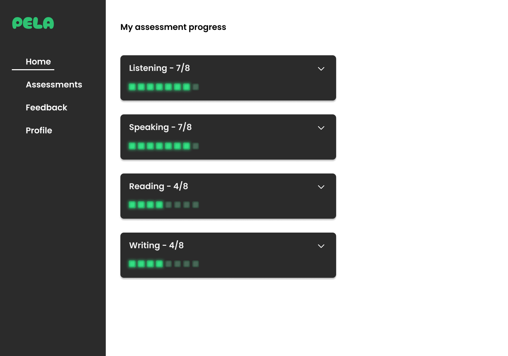
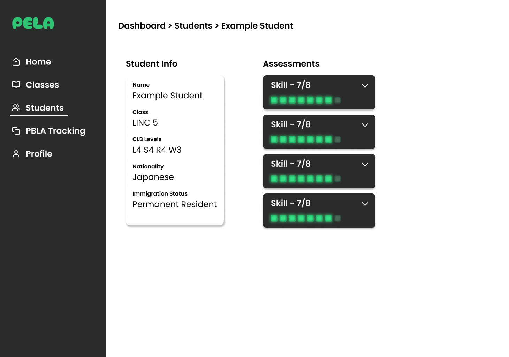
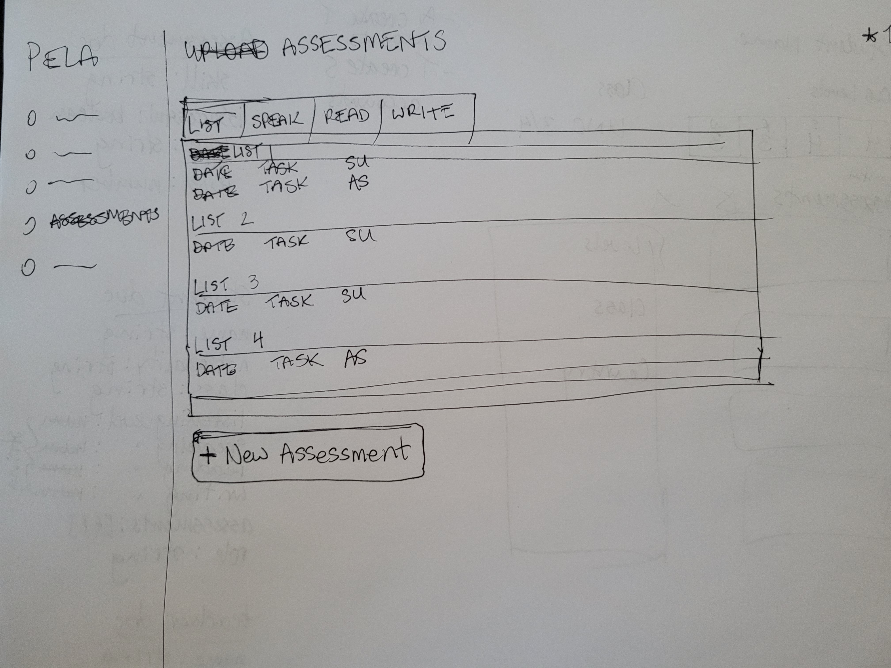
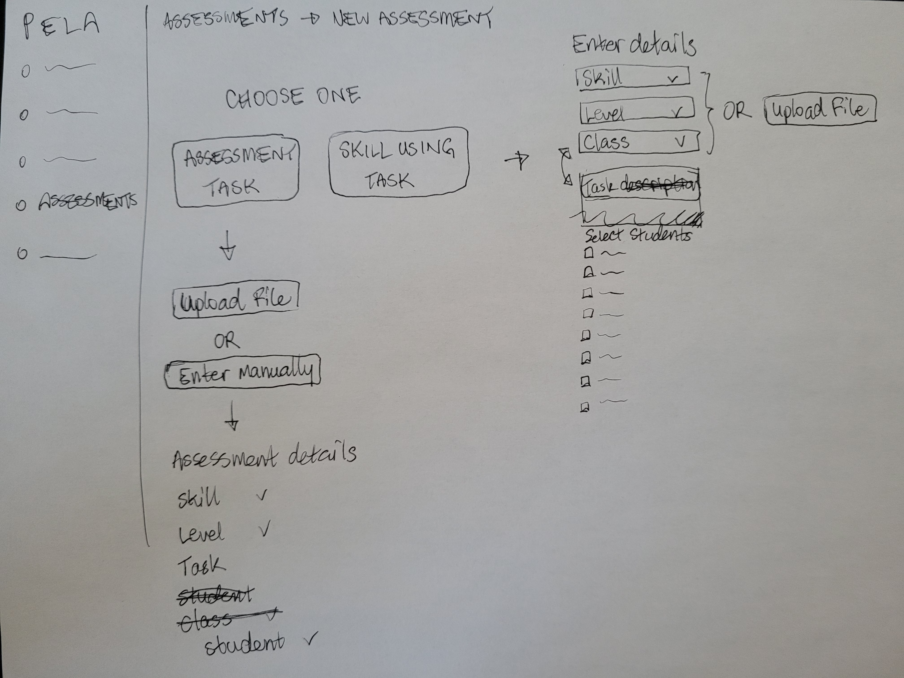

# PELA

## Getting Started

1. Install yarn. `npm install -g yarn`
2. `yarn install`
3. `yarn dev`

### Hosting

1. `npm install -g firebase-tools`
2. `firebase login`
3. `yarn deploy`

### Stuck?

Try This

1. Navigate to: <https://console.firebase.google.com/> (make sure you are using the same account as you used for login)
1. Open your project, and navigate to 'Project Overview > Project settings'
1. Scroll down to 'Your apps' section and click on the web-app symbol (</>)
1. Follow the prompts and in the 2nd step, copy down the `const firebaseConfig` section as you will need it soon
1. Navigate to 'Build > Authentication', click 'Get started', and then follow the prompts to setup 'email/password' and 'Google' providers
1. Navigate to 'Build > Firestore Database', click 'Create database', and select 'Start in test mode'
1. Navigate to 'Build > Storage', click 'Get started', and select 'Start in test mode'
1. In the root folder, **copy** `env.local.example` and rename to `env.local` and open it
1. Enter the `authDomain`, `apiKey`, `projectId`, `storageBucket` into `env.local` to their respective variables
1. `yarn dev`
1. Once you can run locally, run `yarn deploy`

<!---
*** WHEN YOU ARE UP AND RUNNING, DELETE EVERYTHING ABOVE ME EXCEPT THE VERY TOP LINE. ***
*** RENAME THE TOP LINE WITH YOUR PROJECT NAME. ***
-->

## Sprint Progress

Update your progress by checking off the tasks for each sprint. We will **not** be using issues for solo projects.

### Sprint 1

- [✅] Get app approved (DM Scott for approval)
- [✅] Create mockups (physical paper, low-fi)
- [ ] Define scope (DM Scott for approval)
     - [ ] Define milestones for each sprint
     - [ ] Define final deliverable for v1
- [ ] App must
     - [ ] Be publicly accessible
     - [ ] Have working authentication
     - [ ] Have technical component 5% done

### Sprint 2

- [ ] Teacher and student routing complete
- [ ] Student UI 100%
- [ ] Teacher UI 50%
     - [ ] Navigation
     - [ ] New assessment button
     - [ ] Upload file button
     - [ ] Profile
     - [ ] View student
- [ ] Technical component 25%
     - [ ] Able to upload a file and store it
- [ ] Re-evaluate milestones and features

### Sprint 3

- [ ] Re-evaluate milestones and features
- [ ] Teacher UI 100%
     - [ ] New assessment form flow
     - [ ] Tabular visualization of assessment stats by student
- [ ] Technical component 50%
     - [ ] Able to detect information from an uploaded file and generate an object from it

### Sprint 4

- [ ] Technical component 100%
     - [ ] Able to detect details from an uploaded file and generate an object
     - [ ] Able to auto fill new assessment form with detected information
- [ ] Student UI
     - [ ] View assessment summary
     - [ ] View details about each assessment, including originally uploaded document
     - [ ] View feedback
     - [ ] Profile
- [ ] Teacher UI
     - [ ] Dashboard
     - [ ] List of classes/students
     - [ ] Tabular visualization of assessment stats by student
     - [ ] Form flow for uploading new assessment

## Mockups

[*Replace me with mockups*]

|  |  |
| ------------------------------------- | ---------------------------------------- |
|              |                 |
